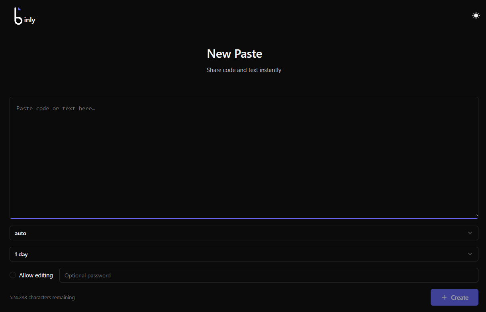

# Binly

Share code and text instantly. No signup, no clutter, no compromise.



## Quick Start

```bash
git clone https://github.com/brendlij/Binly.git
cd Binly
export APP_SECRET=$(openssl rand -hex 32)
docker compose up -d
```

Visit `http://localhost:7700`

## Features

Clean code sharing with syntax highlighting, temporary expiration, optional editing, and password protection.

## Documentation

- [Getting Started](docs/getting-started.md) — Setup and configuration
- [API Reference](docs/api.md) — Complete endpoint documentation
- [User Guide](docs/guide.md) — Features and usage

## Tech Stack

- Go backend with REST API
- Vue 3 + TypeScript frontend
- SQLite database
- highlight.js for syntax highlighting

## Development

```bash
# Frontend
cd web && bun install && bun dev

# Backend
cd backend/cmd/server && go run . --db ../../data/pastes.db --ui ../../web/dist --addr :8080
```

- Frontend: `http://localhost:5173`
- Backend: `http://localhost:8080`

## License

MIT
